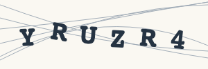

# Six CAPTCHA cases, two providers — September 23, 2026

The broader cohort created **120 new tasks: ten trials per provider for each of six cases**. The earlier four Google-v2 tasks in [paid-comparison.json](paid-comparison.json) are a separate cohort; **124 paid tasks** were created across the two experiments. No task-creation retries were made.

All rows below retain ten planned/created tasks as the denominator. Timing summarizes returned solutions only; failed tasks remain in the outcome counts. These are dated sample observations, not production reliability estimates.

| Case | Provider | Outcome / 10 tasks | SDK latency: median [min–max], seconds | Reported cost, USD (receipt coverage) |
|---|---|---|---|---|
| reCAPTCHA v2 checkbox | 2Captcha | 10/10 accepted | 30.75 [0.28–61.33]; n=10 | $0.02990 (10/10) |
| reCAPTCHA v2 checkbox | Anti-Captcha | 10/10 accepted | 26.10 [16.83–125.89]; n=10 | $0.02000 (10/10) |
| Invisible reCAPTCHA v2 | 2Captcha | 10/10 accepted | 10.49 [0.26–61.21]; n=10 | $0.02990 (10/10) |
| Invisible reCAPTCHA v2 | Anti-Captcha | 10/10 accepted | 32.47 [10.93–196.55]; n=10 | $0.02000 (10/10) |
| reCAPTCHA v3 | 2Captcha | 10/10 accepted | 20.58 [10.44–20.70]; n=10 | $0.02990 (10/10) |
| reCAPTCHA v3 | Anti-Captcha | 10/10 accepted | 16.83 [10.68–16.89]; n=10 | $0.01500 (10/10) |
| GeeTest v4 | 2Captcha | 10/10 accepted | 15.54 [10.40–40.95]; n=10 | $0.02990 (10/10) |
| GeeTest v4 | Anti-Captcha | 5/10 accepted | 23.02 [16.86–47.72]; n=5 | $0.00900 (5/10) |
| Turnstile token delivery | 2Captcha | 10/10 tokens; unverified | 10.46 [10.42–20.72]; n=10 | $0.01450 (10/10) |
| Turnstile token delivery | Anti-Captcha | 10/10 tokens; unverified | 13.78 [10.69–23.00]; n=10 | $0.02000 (10/10) |
| Synthetic image OCR | 2Captcha | 10/10 correct | 10.49 [10.42–10.58]; n=10 | $0.010 (10/10) |
| Synthetic image OCR | Anti-Captcha | 10/10 correct | 7.84 [7.70–14.05]; n=10 | $0.00600 (10/10) |

Full per-trial records, score values, replay responses, error codes, receipt coverage and workflow timings are retained in [broad-comparison.json](broad-comparison.json) and [the trial directory](expected_output/broad-2026-09-23/). Rebuild the summary with `summarize_broad.py`; no network or keys are needed.

### Failures, scores and spending

- 2Captcha v3 score distribution (score: count): 0.9: 10. The required threshold was0.5; every accepted result also matched hostname and action.
- Anti-Captcha v3 score distribution (score: count): 0.9: 10. The required threshold was0.5; every accepted result also matched hostname and action.
- Anti-Captcha / GeeTest v4: five `ERROR_TOKEN_EXPIRED` responses, after63.21–66.24seconds. These tasks are retained without replacement; no server submission occurred without a solution.
- 2Captcha: reported task charges **$0.14410** across 60/60 receipts; combined observed balance decrease **$0.14410** across the pilot and continuation. Unknown task charges are not assumed to be zero.
- Anti-Captcha: reported task charges **$0.09000** across 55/60 receipts; combined observed balance decrease **$0.0880** across the pilot and continuation. Unknown task charges are not assumed to be zero.

The known receipt subtotal is **$0.23410** across115/120 tasks. The observed account decreases sum to **$0.23210**. Anti-Captcha's $0.00200 discrepancy is unreconciled; settlement timing, refunds or other account activity were not established. These are separate observations, not an exact all-task bill.

In this sample, both clients are practical integration candidates. Compare latency and cost within a CAPTCHA type; there is no meaningful combined “success rate” across server acceptance, OCR correctness and unverified token delivery. The first 2Captcha v2 result arrived in less than a second; it is retained as observed, with no claim about how the provider produced it.

For a follow-up GeeTest integration, prioritize 2Captcha based on this demo's10/10 accepted outcomes versus5/10 for Anti-Captcha. Both remain candidates for reCAPTCHA and simple OCR. The differing latency and charge observations above should guide a target-specific follow-up, not a universal provider ranking.

## What the criteria measure

| Case | Fixture | Required observation |
|---|---|---|
| reCAPTCHA v2 checkbox | [Google demo](https://www.google.com/recaptcha/api2/demo) | Paid token submitted through the browser; new document shows `Verification Success`, on the expected URL with HTTP200 |
| Invisible reCAPTCHA v2 | [Google demo](https://recaptcha-demo.appspot.com/recaptcha-v2-invisible.php) | Native form submission with the paid token; new document shows `Success!`, on the expected URL with HTTP200 |
| reCAPTCHA v3 | [Google score demo](https://recaptcha-demo.appspot.com/recaptcha-v3-request-scores.php) | Demo verifier returns boolean success, score at least0.5, hostname `recaptcha-demo.appspot.com`, action `examples/v3scores`, and HTTP200 |
| GeeTest v4 | [2Captcha demo](https://2captcha.com/demo/geetest-v4) | Demo backend receives all five solution fields and returns `result: success` with HTTP200 |
| Turnstile | [Non-interactive public fixture](https://peet.ws/turnstile-test/non-interactive.html) | A nonempty token returned by the provider; **no server acceptance test is available** |
| Image-to-text | [Ten synthetic images and answer manifest](fixtures/image-text/manifest.json) | Returned text equals the known answer after trimming and uppercasing |

The v3 and GeeTest tests call each demo's verification endpoint using Playwright's browser-context request client. They do not exercise a form-click flow. The v3 page's automatic native-token verification is blocked; the paid token is submitted explicitly. The [Google example source](https://github.com/google/recaptcha/blob/main/examples/recaptcha-v3-verify.php) documents the score threshold and hostname/action validation. GeeTest's fixture is hosted by one of the compared vendors, limiting its independence.

The image fixtures contain six alphanumeric characters, rotation and line noise, generated with seed20260923 and rendered in Chromium. Both services receive identical image bytes for each paired trial; answer labels are not sent. This measures simple synthetic OCR, not performance on a representative production CAPTCHA dataset. Committed PNG hashes are checked before submission; font/rendering differences can change regenerated images on another OS.



Two initially considered Turnstile demos used documented dummy keys and were excluded from paid trials. [Cloudflare's testing documentation](https://developers.cloudflare.com/turnstile/troubleshooting/testing/) explains those keys. The selected fixture uses a different public sitekey, but has no form/backend verifier. Its token deliveries must not be described as accepted CAPTCHA solves.

## Controls and replay observations

The retained [negative controls](expected_output/broad-controls-2026-09-23/) deliberately submit invalid values. Google v2 and invisible v2 display explicit rejection, v3 reports failure, GeeTest returns `result: fail` despite `status: success`, and the image answer fails exact comparison. All five final rejection assertions passed. Turnstile records the absence of a server verifier, with no pass/fail assertion.

Two fixture-harness problems were found and corrected before the paid pilot: invisible v2 can render two response fields, and a malformed GeeTest generation timestamp triggers schema rejection instead of testing solution rejection. The final runner fills all response fields and supplies a validly shaped timestamp for the negative control. Initial diagnostic control records are retained separately from the final assertions.

For the first v3 and GeeTest trial per provider, the same solution was immediately submitted twice without creating another paid task. Both v3 replays were accepted; both GeeTest replays were rejected. [Google documents single-use tokens](https://developers.google.com/recaptcha/docs/verify), so the v3 result is a demo-endpoint observation, not evidence against the production contract. We did not establish whether caching or demo configuration explains it. These four extra verification calls are excluded from the primary acceptance denominator.

## Execution and interpretation limits

The matrix uses pinned official synchronous Python SDKs: `2captcha-python2.1.1` and `anticaptchaofficial1.0.70`, Playwright1.63.0 and headless Chromium153.0.8010.12 on macOS26.6.2 arm64/Python3.12.11. Each trial gets a fresh browser context, but all share one submitting host/network. The providers use their own proxyless solver infrastructure. CapSolver remains unavailable without a key.

One trial per provider/case formed a12-task pilot. The same durable job directory was then resumed through ten trials per cell, for a120-task ceiling. Case order is seeded and shuffled within rounds; provider order alternates between rounds. Up to four child processes run concurrently, at most two per provider. Queue delays before the SDK call are excluded from provider latency. SDK polling differs: 2Captcha polls every10seconds; Anti-Captcha uses its native initial delay and1-second polling. Therefore the timings compare these integrations, not pure worker speed. No throughput or population reliability estimate is implied by ten observations per cell.

Each child allows one task creation request. Creation state is persisted before the network request; existing job records, including failures and ambiguous creations, are never automatically retried. HTTP requests have10-second connect and30-second read timeouts; each child also has an external400-second deadline. Killing a child does not cancel a provider task. Use one batch controller per output directory. A different output directory intentionally permits a new paid experiment.

Reported task cost comes from the provider response; 2Captcha's [read-only task-result API](https://2captcha.com/api-docs/get-task-result) supplies receipts for the existing task. Missing charges remain unknown. Account balance decreases are separate batch observations and can be affected by refunds or concurrent account activity; they are not per-task pricing.

Returned tokens, provider task IDs, worker IPs, cookies, raw response bodies, credentials and account balance values are excluded from published artifacts. Invisible-v2 screenshots were excluded after visual review found token text overflowing the mask boundary; their structured verification results remain. The first v2 form-result screenshots are retained. The runtime now omits invisible-v2 screenshots entirely.

## Reproduction

Install the pinned dependencies as described in [README.md](README.md). `./run.sh` performs only free checks. Supply `TWOCAPTCHA_API_KEY` and `ANTICAPTCHA_API_KEY` through the environment for paid runs; never put values in commands or source files.

```bash
python broad_matrix.py                           # plan only; no network or spending
python broad_matrix.py --controls --output run_output/controls
python broad_matrix.py --live --rounds 1 --output run_output/broad
python broad_matrix.py --live --rounds 10 --output run_output/broad  # skips pilot jobs
python summarize_broad.py --input run_output/broad --output run_output/summary.json
# Rebuild the committed summary without network access:
python summarize_broad.py --output run_output/committed-summary.json
```

The live command captures research outcomes, including unsuccessful ones; a completed batch does not mean every CAPTCHA was accepted. Inspect each cell's outcomes and unfinished/missing records. Controls exit nonzero on a failed assertion. Default CI creates no paid tasks.
